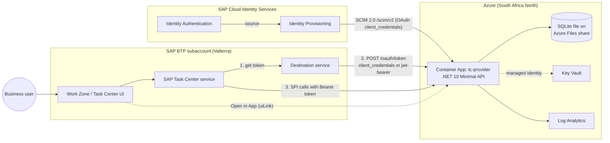
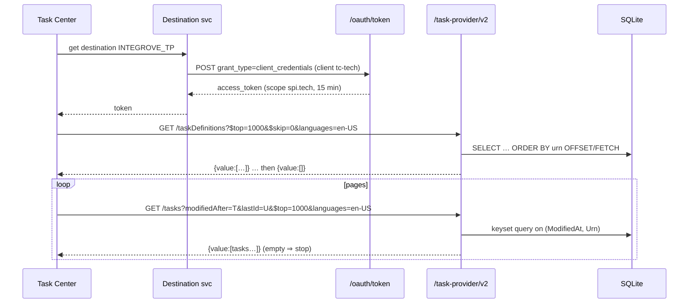
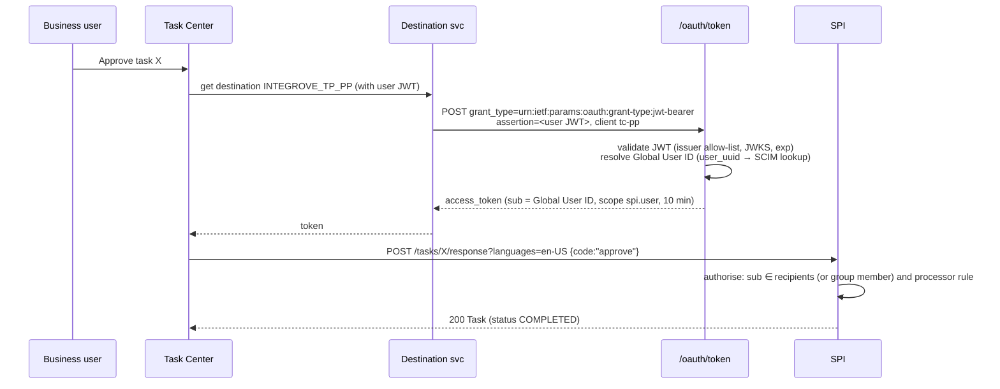
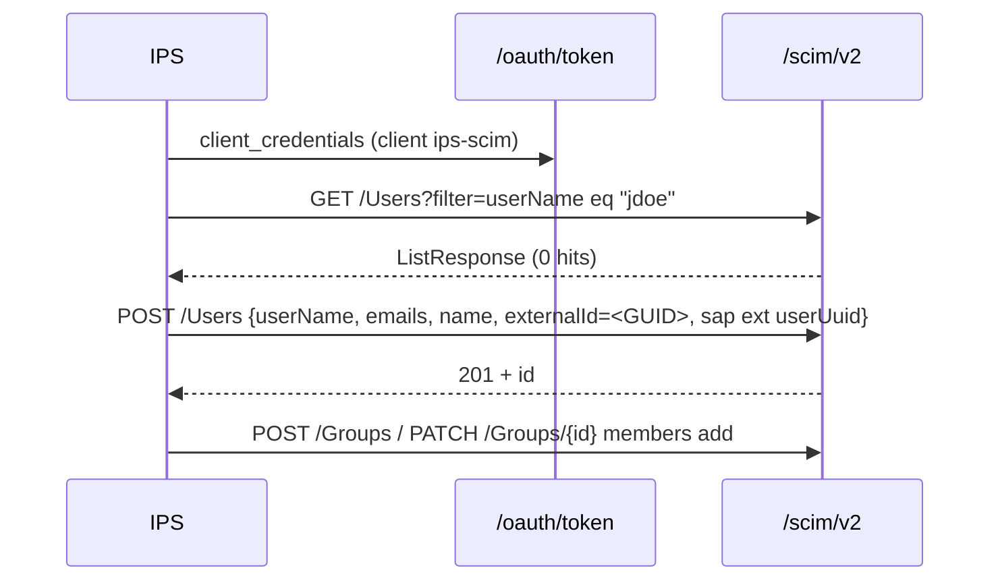
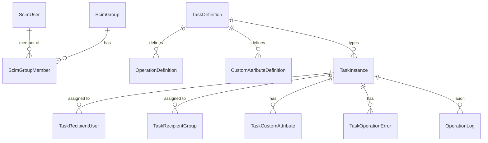

# Architecture — Task Center Provider Prototype ("Integrove TP")

## 1. Context



One container hosts four logical modules sharing one database:

| Module | Path prefix | Caller | Auth |
|---|---|---|---|
| Token service | `/oauth/token`, `/.well-known/jwks.json`, `/.well-known/openid-configuration` | BTP Destination service, IPS | Client authentication (client_secret_basic / client_secret_post) |
| SCIM 2.0 | `/scim/v2/*` | IPS | Bearer (scope `scim`) — Basic optional fallback |
| Task Provider SPI | `/task-provider/v2/*` **and** `/api/task-provider/v2/*` | Task Center | Bearer: scope `spi.tech` (pull) or `spi.user` (PP) |
| Admin + app UI | `/admin/*`, `/app/*` | Integrove testers, business users (deep link) | Admin Basic auth (prototype); IAS OIDC SSO is a stretch item |

## 2. Solution structure

```
src/
  Tcp.Api/                 # Program.cs, endpoint registration, auth, middleware
    Endpoints/Spi/         # TasksEndpoints, TaskDefinitionsEndpoints, CapabilitiesEndpoints, OperationsEndpoints
    Endpoints/Scim/        # UsersEndpoints, GroupsEndpoints, DiscoveryEndpoints
    Endpoints/OAuth/       # TokenEndpoint, JwksEndpoint
    Endpoints/Admin/       # Admin API + static UI (wwwroot/admin)
  Tcp.Domain/              # Task, TaskDefinition, ScimUser, ScimGroup, rules (pure C#)
  Tcp.Infrastructure/      # EF Core DbContext, migrations, Key Vault key provider, JWKS cache
tests/
  Tcp.UnitTests/
  Tcp.IntegrationTests/    # WebApplicationFactory + temporary SQLite files
  Tcp.ContractTests/       # validates responses against contracts/*.yaml|json
infra/                     # main.bicep, modules/*.bicep, azure.yaml (azd)
specs/                     # this spec pack
```

## 3. Key flows

### 3.1 Technical pull (INITIAL / DELTA)



### 3.2 Principal propagation (approve from Task Center)



> Fallback if Task Center/Destination service cannot use `OAuth2JWTBearer` for the `_PP` destination: add the SAML 2.0 bearer grant (`urn:ietf:params:oauth:grant-type:saml2-bearer`) to the same token endpoint and switch the destination to `OAuth2SAMLBearerAssertion`. The grant handler is pluggable by design (see spec 002, FR-PP-10).

### 3.3 User provisioning



## 4. Data model overview



Details: `specs/003-scim-provisioning/data-model.md`, `specs/004-task-provider-spi/data-model.md`. Localised texts are stored as JSON columns (`TEXT` with a `json_valid` check) — simple and adequate for ≤3 languages.

## 5. Azure deployment

| Resource | SKU / setting | Est. USD/month* |
|---|---|---|
| Container Apps environment + app | Consumption, 0.25 vCPU / 0.5 GiB, min replicas 1, max 1 | 3 – 7 (after free grant) |
| Storage account (Azure Files share, SQLite file) | Standard LRS, 5 GiB quota | < 1 |
| Azure Container Registry | Basic | ~5 |
| Key Vault | Standard | < 1 |
| Log Analytics | PerGB2018, 30-day retention, daily cap 0.2 GB | 0 – 2 |
| **Total** | | **≈ 10 – 15** |

\*Estimates at list price; confirm in the Azure Pricing Calculator for South Africa North. Delta pulls every 30 s keep the app warm, so scale-to-zero gives no saving while the destination is enabled. The database is a SQLite file (ADR-011), so the app runs as a single replica.

Ingress: external HTTPS on the default `*.azurecontainerapps.io` FQDN (managed TLS). Custom domain optional. Optional IP restriction on `/scim` and `/task-provider` to SAP BTP/IPS egress ranges (stretch).

## 6. Configuration (environment / Key Vault)

| Key | Example | Notes |
|---|---|---|
| `Provider__ApplicationId` | `integrove` | URN part |
| `Provider__ApplicationInstanceId` | `tcproto` | URN part |
| `Provider__TenantId` | `valterra-dev` | URN part |
| `Provider__PublicBaseUrl` | `https://tc-provider.<env>.southafricanorth.azurecontainerapps.io` | uiLink + issuer |
| `Provider__DefaultLanguage` | `en-US` | `isDefault` text |
| `OAuth__Issuer` | `${PublicBaseUrl}` | |
| `OAuth__Clients__0__ClientId` | `tc-tech` | secret in KV `oauth-client-tc-tech` |
| `OAuth__Clients__1__ClientId` | `tc-pp` | grants: jwt-bearer |
| `OAuth__Clients__2__ClientId` | `ips-scim` | scope scim |
| `OAuth__TrustedAssertionIssuers__0` | `https://<subdomain>.authentication.eu10.hana.ondemand.com/oauth/token` | XSUAA |
| `OAuth__TrustedAssertionIssuers__1` | `https://<tenant>.accounts.ondemand.com` | IAS |
| `OAuth__UserIdClaims` | `user_uuid,sub` | ordered claim lookup |
| `OAuth__SigningKeySecretName` | `token-signing-key` | RSA 2048 PEM in KV |
| `Admin__BasicUser` / KV `admin-password` | | |
| `ConnectionStrings__Sql` | `Server=tcp:…;Authentication=Active Directory Managed Identity;Database=tcp` | |
| `Diagnostics__RequestLogSize` | `500` | ring buffer |
